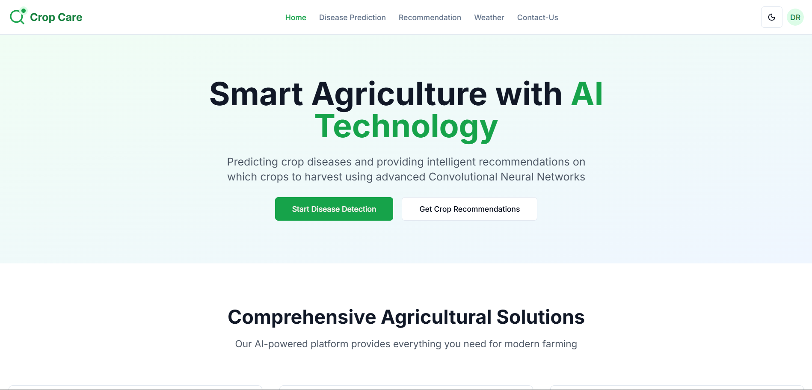
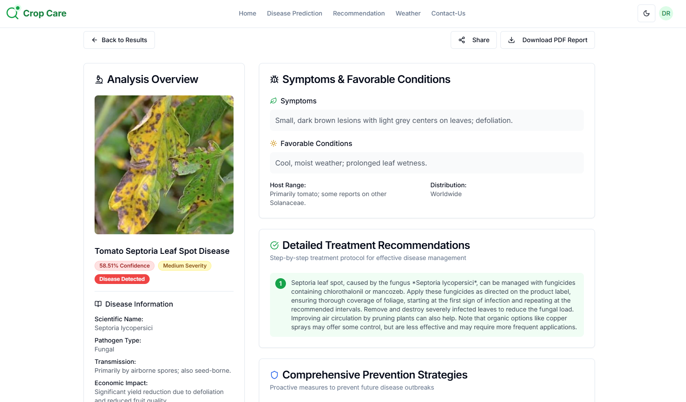
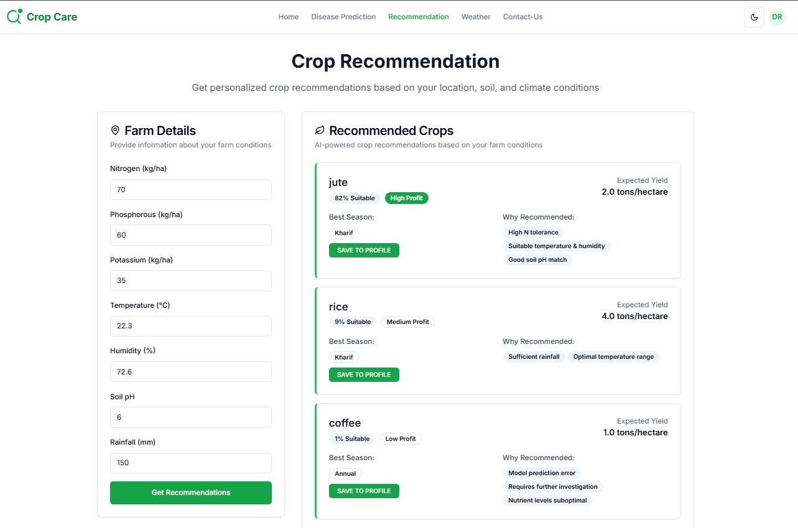
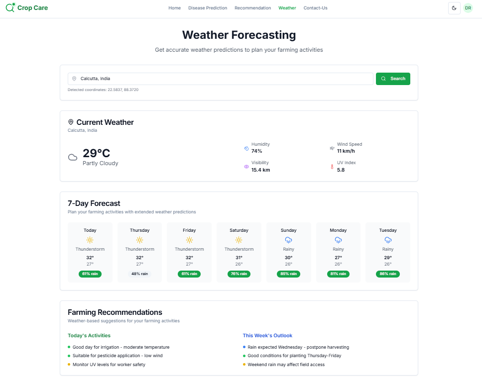
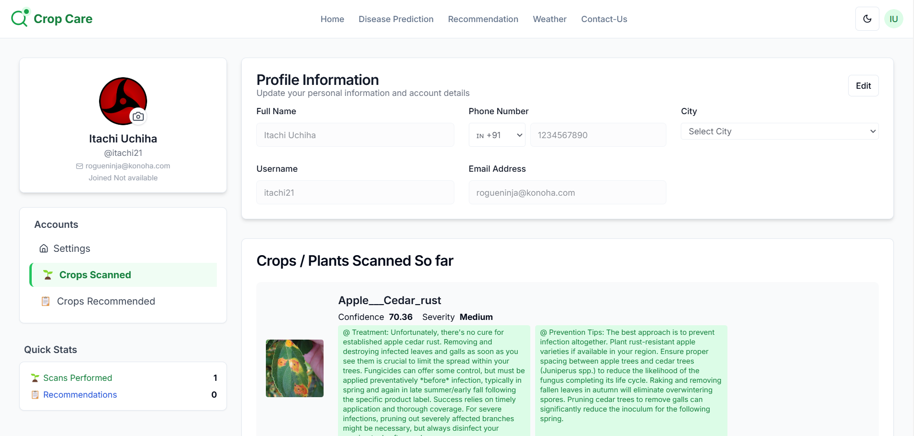

# 🌾 Crop Care - AI-Powered Agricultural Platform

Crop Care is a modern web platform designed to empower farmers and agricultural professionals with advanced AI tools. Effortlessly predict crop diseases, receive personalized crop recommendations, and access real-time weather insights—all in one place. The backend, featuring two powerful machine learning models (Disease Prediction and Crop Recommendation), is securely deployed on Hugging Face for robust and scalable performance.



## 🚀 What Can You Do with Crop Care?

- **Disease Prediction:** Upload a photo of your crop leaf and instantly detect possible diseases, along with detailed treatment and prevention strategies.
- **Crop Recommendation:** Get smart, data-driven suggestions on which crops to plant based on your local conditions.
- **Weather Forecasting:** Access up-to-date weather data to plan your farming activities more effectively.
- **Personal Dashboard:** Manage your profile, view past predictions, and save/share reports with ease.
- **Seamless Sharing:** Generate shareable reports for collaboration or expert consultation.

### Platform Highlights

- Clean, intuitive interface for all devices
- Fast, secure authentication and user management
- All AI/ML processing handled by a robust backend (Hugging Face)
- No technical expertise required—just upload, click, and get actionable insights!

---

<div align="center">
  
  
  
  
</div>

---

## 🛠️ Getting Started

### Prerequisites
- Node.js 18+
- MongoDB Atlas account

### 1. Clone the Repository
```bash
git clone https://github.com/D-roy-2003/CropCare.git
cd CropCare
```

### 2. Install Dependencies
```bash
npm install
```

### 3. Environment Configuration
Create a `.env.local` file in the root directory:

```env
# MongoDB Configuration
MONGODB_URI=your_mongodb_connection_string

# JWT Configuration
JWT_SECRET=your_jwt_secret
JWT_EXPIRES_IN=7d

# Application URL
NEXTAUTH_URL=your_deployed_vercel_link

# Security
BCRYPT_ROUNDS=12

GEMINI_API_KEY=your_gemini_api_key

# Backend API
BACKEND_URL=your_backend_api_url

NEXT_PUBLIC_SUPABASE_URL=your_supabase_url
NEXT_PUBLIC_FORMSPREE_ENDPOINT=your_formspree_endpoint
NEXT_PUBLIC_SITE_URL=your_deployed_vercel_link
```

### 4. Run the Development Server
```bash
npm run dev
```

Open [http://localhost:3000](http://localhost:3000) to view the application.

---

## 📁 Project Structure

```plaintext
CropCare/
├── app/                    # Next.js App Router (API routes, pages, layouts, etc.)
│   ├── api/                # API endpoints (disease prediction, recommendation, etc.)
│   ├── disease-details/    # Disease details client and page
│   ├── disease-prediction/ # Disease prediction UI
│   ├── profile/            # User profile page
│   ├── recommendation/     # Crop recommendation UI
│   ├── shared/             # Shared report pages
│   ├── weather/            # Weather forecast UI
│   ├── ...                 # Other feature folders (login, signup, contact, etc.)
│   └── globals.css         # Global styles
├── backend-api/            # Backend API (ML model serving, Docker, etc.)
├── components/             # Reusable UI components (navbar, footer, shadcn/ui, etc.)
├── hooks/                  # Custom React hooks
├── lib/                    # Utility libraries (auth, db, PDF, validation, etc.)
├── mlmodel_training/       # Jupyter notebooks and scripts for ML model training
├── models/                 # MongoDB models (User, DiseasePrediction, etc.)
├── public/                 # Static assets (images, icons, etc.)
├── styles/                 # Additional CSS files
├── CropCare-mirror/        # Git mirror/backup (if used)
├── middleware.ts           # Next.js middleware
├── package.json            # Project dependencies and scripts
├── README.md               # Project documentation
└── ...                     # Config files, scripts, etc.
```

---

## 🤝 Contributing

1. Fork the repository
2. Create a feature branch (`git checkout -b feature/amazing-feature`)
3. Commit your changes (`git commit -m 'Add amazing feature'`)
4. Push to the branch (`git push origin feature/amazing-feature`)
5. Open a Pull Request

---

## 📝 License

This project is licensed under the MIT License - see the [LICENSE](LICENSE) file for details.

---

## 👤 Developer

- [Debangshu Roy](https://github.com/D-roy-2003)

---

## 📞 Support

For support, email debangshuroy2020@gmail.com or create an issue in this repository.

---

**Made with ❤️ for farmers worldwide** 🌾